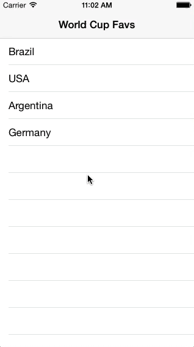

SwiftCoreDataPart1
==================

Swift, CoreData, TableView 

This is the first of 3 tutorials explaining how to use CoreData in a Swift project. Part 1 explains the setup of the project, adding a TableView, filling the table with dummy content, segueing between ViewControllers based on the selection of a specific cell in your Table, and referencing your first ViewControllers variables inside of your second ViewController to use inside of a UILable and as your NavigationTitle. In the following tutorials, we will discuss implementing CoreData into the project and making our content dynamic, as well as, styling our application to prepare it for submission to the App Store. Watch the video tutorial here: http://youtu.be/I7n3t5eAkoo
